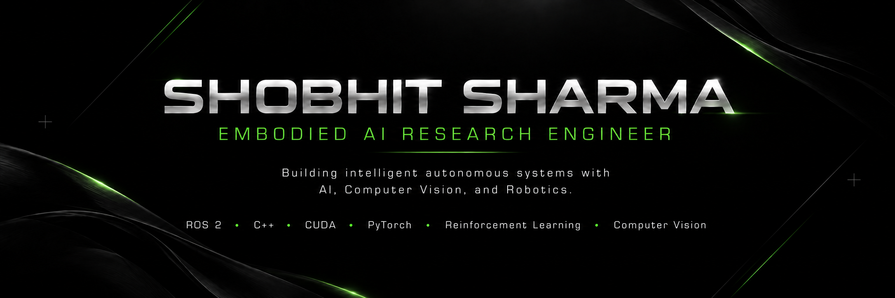
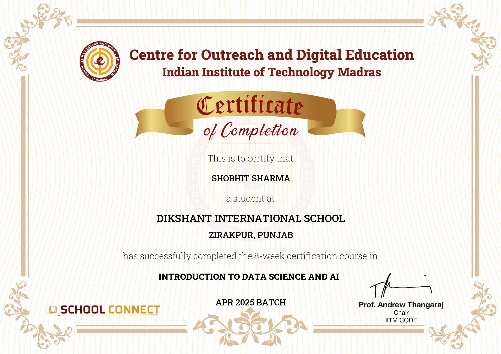
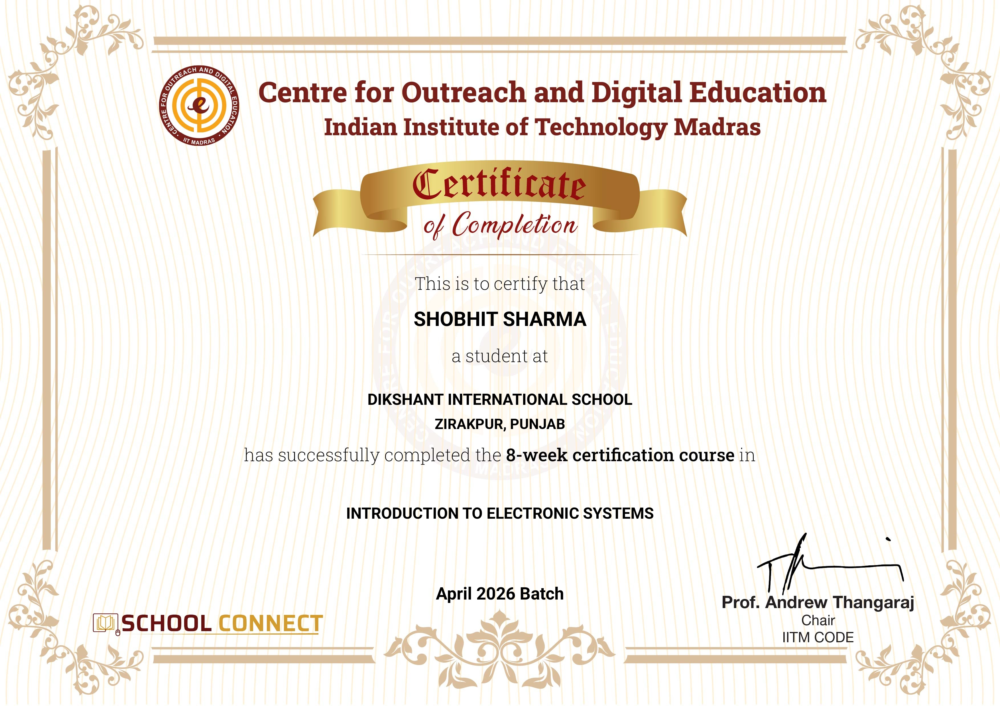

 

---

<h3>👋 About Me</h3>

I build robots and AI systems — exploring how machines can perceive, learn, and interact with the world.

➤‎ ‎ ‎Currently working on robotics projects involving <b>ROS 2</b>, <b>Computer Vision</b>, and <b>autonomous navigation</b>.
 
➤‎‎ ‎ Most days I'm deep into <b>C++</b> / <b>Python</b> / <b>PyTorch</b> / <b>CUDA</b> / <b>OpenCV</b>.
 
➤ ‎‎ Currently exploring <b>SLAM</b>, <b>simulation</b>, <b>reinforcement learning</b>, and <b>edge AI</b>.

💡 <b>Fun fact:</b> I like breaking robots, debugging them, and figuring out why they stopped moving.

---

### 💻 Tech Stack

### Core Languages

**C++ • Python**

---

### Also Familiar With

**C • JavaScript • TypeScript • SQL**

---

### 🤖 Robotics

---

### 🧠 AI / Computer Vision

---

### ⚙️ Development

Git • Docker • Linux • CMake • VS Code

---

# Featured Projects

Coming Soon.

Current focus is building production-quality robotics projects including

- Autonomous Mobile Robot
- Vision-Based Robot Navigation
- SLAM
- AI Robot Dog
- Reinforcement Learning Robot
- CUDA Accelerated Vision Pipeline

---

### 📊 Activity

---

### 🏆 Certifications

  

<a href="certifications/">
  <b>View All Certifications→</b>
</a>

---

### 🌐 Connect With Me

&nbsp;&nbsp;&nbsp;&nbsp;

&nbsp;&nbsp;&nbsp;&nbsp;

&nbsp;&nbsp;&nbsp;&nbsp;

&nbsp;&nbsp;&nbsp;&nbsp;

 

<h2>
  
<i>Focus on the craft, not the applaus!.</i>
</h2>

